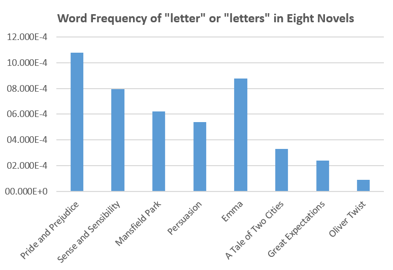
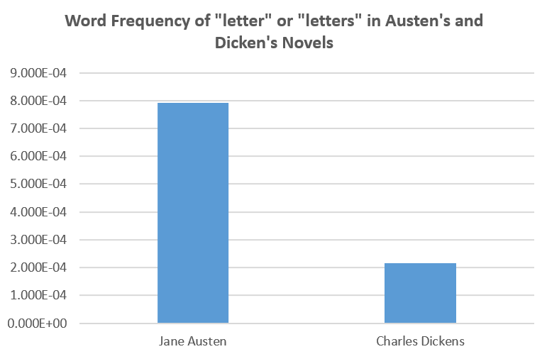

## Coding and Visualization for Week Two

### Blog post for week two
https://scholarblogs.emory.edu/582atextmining/2016/09/08/use-of-letters-of-austen-and-dickens-and-comparison-between-two-austens-novels/

### Visulizations
Tool: Excel (Later would switch main tool to ggplot2)

