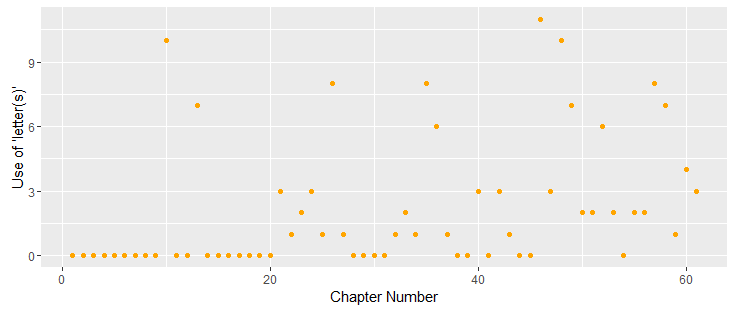
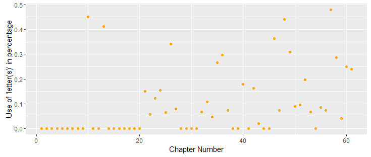

## Coding and Visualization of Week Three

### Blog Post
https://scholarblogs.emory.edu/582atextmining/2016/09/08/use-of-letters-of-austen-and-dickens-and-comparison-between-two-austens-novels/2/

### Visualization
Tool: ggplot2

This week's visualization is about Jane Austen's *Pride and Prejudice*

